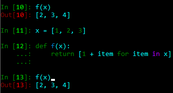
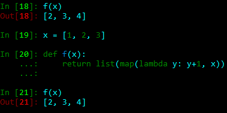

# 常见问题

* 出自庞老师的课件中的舍选法写法：

  

  被广大同学复制粘贴使用，这段代码有两个需要注意的地方：

  1，实际上，对均匀分布可以直接用

  ```python
  x = np.random.uniform(xmin, xmax, size)
  ```

  同理，对正态分布可以直接用

  ```python
  x = np.random.normal(mu, sigma, size)
  ```

  有的同学选择的是``np.random.rand``来抽样均匀分布，``np.random.randn``来抽样正态分布，当然也没有问题。

  2，``np.zeros(shape=size, dtype=dtype)``这里的size要求是一个整型或者array-like，如果只要产生一维的，可以只给一个整型n，如果要高维的，记得用tuple或者list把每个维度的长度包起来，即

  ``shape=(d0, d1, d2, ...)``这样，不能直接写``np.zeors(d0, d1, ...)``，这和``np.random.rand``的用法是不一样的，需要注意。

* 同样出自庞老师课件中，把QG_jet的数据转化成28乘28的图：

  

  1，``normd``参数将在以后的版本中被舍弃，转而使用``density``参数。

  2，``img, _, _ = xxx``这里的两个下斜线是因为``np.histogram2d``的返回值有3个（或者说是1个有3个元素的list），第一个是返回的热度图，第二个和第三个分别是x和y的bin edge，由于不需要用edge的信息，所以用下斜线表示“这有一个变量，但我不需要储存它”。

  类似的用法有``x = [0 for _ in range(1000)]``，可以初始化一个长度为1000的list。

  3，再扩展一下，可以思考，为什么在庞老师写的舍选法中，要先声明一个``samples = np.zeors(n, dtype=np.float32)``，然后依次按索引给``samples``赋值，而不是这样做：

  ```python
  def rejection_sampling(pdf, n, ymax, xmin, xmax):
      samples = []
      i = 0
      while i < n:
          x = np.ramdon.uniform(xmin, xmax)
          y = np.random.uniform(0, ymax)
          if y < pdf(x):
              samples.append(x)
              i += 1
      samples = np.array(samples)
      return samples
  ```

  初始化一个空的list然后依次调用``append``方法来增加元素？

  原因是python中对append的处理，会在每次调用时复制一个新的list，然后把新的元素加进去，在list较小时影响不大，但是如果list长度比较大，对内存的开销则会不断地增大。

  因此，如果已知所需要的list（或者array）的长度，建议是直接初始化一个该长度的list（或者array），然后按索引填值。

  

* 出自神经网络作业的同学提问：

  

  1，batch normalization会引入训练集上的每个channel的均值和标准差作为非训练参数。

  2，训练集较小，如果防止过拟合的trick不够，迭代次数过大会因为过拟合而导致验证集精度下降。如果训练效果已经饱和，精度也不会明显下降，而是在最优点附近震荡。

  3.1，模型的权重参数初始化不同是按某个分布随机的，虽然分布可能是确定的，但是得到的初始值是不确定的；

  3.2，train_test_split对训练集的划分结果是随机的，虽然event数量是一定的，但是这个集合里有哪些event不是确定的；

  3.3，训练时输入的event的顺序是打乱的。

  4，没看懂她的问题。

  5，她确实搞错了。在模型的构造上有点问题。

  工业界和学术界对BN和激活函数的顺序其实一直都有争议，（尤其是激活函数选ReLU时）。不过最好不要在输入层之后接BN然后马上接ReLU。对输入层的归一化应该在预处理时做，而不是在神经网络里面加BN。紧接ReLU就更没道理了。

* 出自蒙特卡洛抽样的作业：

  

  ``ymax=p_theta_norm.max()``是一种不太规范的写法，函数参数的默认值应该是你自己给定的，而不应该取决于某个不知道具体是多少的数组。

  这里大可不给默认值，而是在调用该函数进行抽样时单独指定``ymax``的值。

  扩展一下，如果不想给``ymax``的默认值，但是你会发现``def rejection_sampling(pdf=Theta_norm, n=100000, ymax, xmin=0.2, xmax=np.pi)``会报错，因为不给默认值的参数要放在给默认值的前面。调整参数表的顺序即可。

* 出自同学提问：

  

  因为``1/2/np.pi``只是一个数，而``np.sin(phi-phi)``等价于``np.zeros_like(phi)``，是一个长度与``phi``一样的全0数组，根据numpy的计算规则，一个数加一个数组，结果是这个数组的每个值依次加上该数。

  这一句等价为``return np.ones_like(phi, dtype=np.float32) * 1/2/np.pi``。

  如果只返回``1/2/np.pi``，那么画图的第二个参数就是一个数字，而第一个参数是一个数组，长度不匹配画不了图。

* 出自同学提问：

  

  按cell的顺序来解释一下为什么会有这个输出：

  1，

  ```python
  x = [1, 2, 3]
  def f(x):
      return x
  f(x)
  ```

  这个函数就是单纯的吃什么拉什么，输入一个数组，原封不动返回这个数组。

  2，

  ```python
  np.sin(x)
  ```

  ``np.sin()``接受一个数或者array-like，如果是数则返回这个数的正弦值，如果是array-like则返回一个数组，形状与输入一致，对应元素为输入的正弦值。

  3，

  ```python
  x = [1, 2, 3]
  def f(x):
      return 1 + np.sin(x)
  f(x)
  ```

  由于``np.sin(x)``已经把x这个list变成了一个array，根据numpy的计算规则，直接给每个元素加上1，于是得到了一个新的数组，值为输入的对应值的正弦值加一。

  4，

  ```python
  x = [1, 2, 3]
  def f(x):
      return 1 + x
  f(x)
  ```

  报错了，因为numpy的array是重载了加号算符的，所以可以直接用数加，但是python原生的list并不支持这个运算。

  如果硬要用list做，可供参考的写法：

  ```python
  x = [1, 2, 3]
  def f(x):
      return [1 + item for item in x]
  f(x)
  ```

  结果如图

  

  也可以用python原生的map方法做映射，然后转化为list：

  ```python
  x = [1, 2, 3]
  def f(x):
      return list(map(lambda y: y+1, x))
  f(x)
  ```

  结果如图

  

  可以做，但没必要。

* 出自同学提问：

  

  在0的地方不是太大了，是正无穷。

  事实上，不妨先看看在足够小的值时函数有怎样的表现:

  ```python
  def func(x):
      return np.sin(x/2)**(-3)
  
  x = np.array([0.1**i for i in range(10)])
  y = func(x)
  for item in y:
      print('{:.2e}'.format(item))
  ```

  可以得到：

  

  可以看到，每次对x缩小10倍，函数值会扩大1000倍，相比0.1的8千，0.01的8百万已经很大了，所以对$\sin(\theta/2)$做一个0.1的cut是比较合理的，如果你不想这样粗暴的截断，不妨做一个稍微没那么粗糙一些的近似：

  ```python
  res = [0 for _ in range(n)]
  counter = 0
  while counter < n:
      x = np.ramdon.uniform(0, 1)
      y = np.ramdon.uniform(pmin, pmax)
      if x < 0.1 or y < pdf(x):
          res[counter] = x
          counter += 1
  res = np.array(res)
  ```

  本质上是分段做抽样，在某个点（0.1）左边的自动接受，在其右边的按pdf.抽样来接受，这个点可以定得更小一点，这个点越靠近0，采样就越精准。显然，这个点定在0的时候是最准的，但是那个点是个奇点，你将算不出一个有限大的pmax，于是这个算法会失效。

  所以说这是**没那么粗糙一些的近似**而不是精准的采样方法。

  如果要用随机行走呢？

  那么抽样将简单很多，我们只需要根据建议函数，依次产生出一系列抽样点，就可以无视在接近0的点pdf值过大的问题。

  可惜，我们不知道建议函数长什么样子。至少我不知道。

  ***

  

